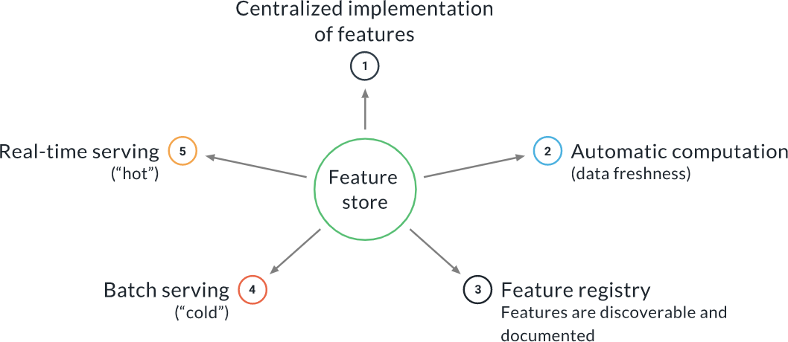
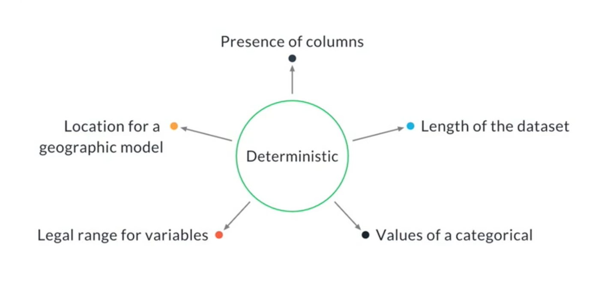
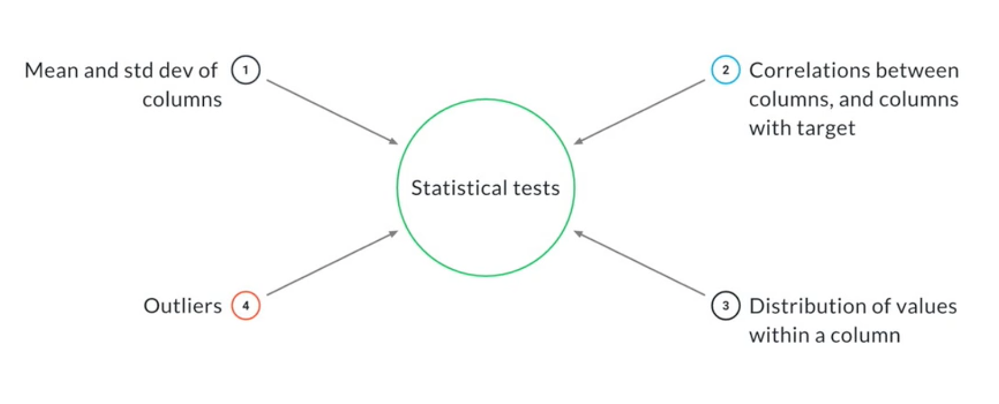
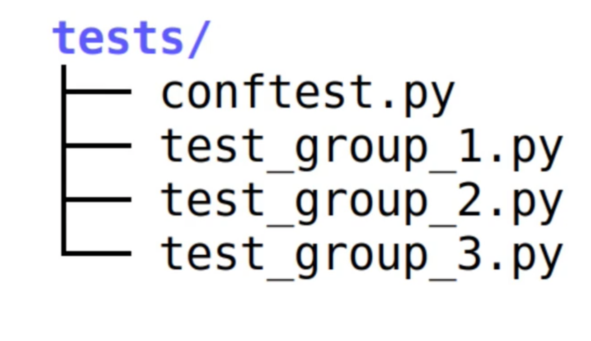
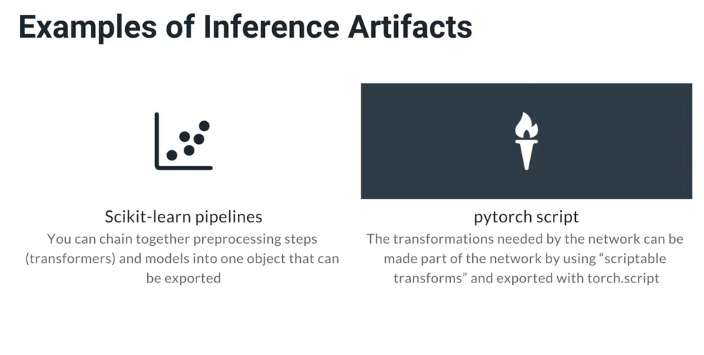

Prerequisite:
* conda 

### Create conda environment for this course:
`conda create --name udacity-ml-devops-nano-2 python=3.8 mlflow jupyter pandas matplotlib requests -c conda-forge`

### activate created environment:
`conda activate udacity-ml-devops-nano-2`
                OR
`source activate udacity-ml-devops-nano-2`

### Since weight/biases is not available on conda, install it via pip:
`pip install wandb`

### wandb login:
`wandb login`

### test wandb:
```
source activate udacity
echo "wandb test" > wandb_test
wandb artifact put -n testing/artifact_test wandb_test
```


Machine learning pipeline:


## Recap Lesson 1: Introduction to Reproducible Model Workflows

**Machine Learning Operations**: MLops is a set of best practices and methods for an efficient end-to-end development and operation of performant, scalable, reliable, automated and reproducible ML solutions in a real production setting.

**Reproducible Workflow**: An orchestrated, tracked and versioned workflow that can be reproduced and inspected.

Exercise 2:
Created conda.yaml and MLProject files for creating MLFlow run, and used below command:
```
mlflow run . -P file_url=https://raw.githubusercontent.com/scikit-learn/scikit-learn/4dfdfb4e1bb3719628753a4ece995a1b2fa5312a/sklearn/datasets/data/iris.csv -P artifact_name=iris -P artifact_description="This data sets consists of 3 different types of irises’ (Setosa, Versicolour, and Virginica) petal and sepal length"

```
-----------------

## Recap Lesson 2: Machine Learning Pipelines:

* The three levels of MLops
* A refresher on using argparse
* Versioning data and artifacts with Weights and Biases
* ML pipeline Components in MLflow
* Linking together the components of a pipeline
* Conda vs. Docker

**Artifact**: The product of a pipeline component. It can be a file (an image, a model export, model weights, a text file...) or a directory.

**Component**: One step in a Machine Learning Pipeline. In MLflow, a component is characterized by an environment file (conda.yml if you are using conda), an entry point definition file (MLproject) and one or more scripts or commands to be executed and their supporting code.

**Container**: A technology to package together the entire runtime of a software, i.e., the code itself and all its dependencies and data files. Containers can be spun up quickly, and they run identically across different environments.

**Data Segregation**: The process of splitting the data, for example into train and test sets.

**Environment (runtime)**: The environment where a software runs. In mlflow it is described by the conda.yml file (or the equivalent Dockerfile if using Docker).

**Experiment**: A tracked and controlled execution of one or more related software components, or an entire pipeline. In W&B the experiment is called group.

**Hyperparameters**: The parameters of a model that are set by the user and do not vary during the optimization or fit. They cannot be estimated from the data.

**Job Type**: Used by W&B to distinguish different components when organizing the ML pipeline. It is mostly used for the visualization of the pipeline.

**Machine Learning Pipeline**: A sequence of one or more components linked together by artifacts, and controlled by hyperparameters and/or configurations. It should be tracked and reproducible.

**Project**: All the code, the experiments and the data that are needed to reach a particular goal, for example, a classification of cats vs dogs.

**Run**: The minimal unit of execution in W&B and in all tracking software. It usually represents the execution of one script or one notebook, but it can sometimes contain more; for example, one script that spawns other scripts.

-----------------

## Recap Lesson 3: Data Exploration and Preparation: 

**Note**: If an operation is needed for training and validation data **as well as for production data. It should not be part of preprocessing step instead it should be part of inference pipeline**.  <br>

**Exploratory Data Analysis (EDA)**: An interactive analysis performed at the beginning of the project, to explore the data and learn as much as possible from it. It informs many decisions about the development of a model. For example, we typically discover what kind of pre-processing the data needs before it can be used for training or for inference. It is also important to verify assumptions that have been made about the data and the problem.  <br>

**Feature engineering**: FE is the process of creating new features by combining and/or transforming existing features. 
For ex: If we have height and width as features, we could engineer a feature called the Body Mass Index, which is defined as height / weight^2 <br>

**Feature Store**: Feature store is a centralized implementation of the features and it serves them at training and inference time. FS is a MLops tool that can store the definition as well as the implementation of features, and serve them for online (real-time) inference with low latency and for offline (batch) inference with high throughput. <br>



-----------------

## Recap Lesson 4: Data Validation: 

Data validation is an important step in ML Pipelines. This is very useful to find out the unexpected changes in data so that we can retrain the model. Generally Data validation step can be placed before and after of Data Segregation.

For example: We have deployed an ML Model which uses one feature called `ratings`, which is expected to be in range of 0 - 5 but due to some changes at the input source, now the incoming `rating` range has been changed to 0 - 10. Therefore Without **Data Validation** step in pipeline the prediction will be impacted. 

**pytest**: Pytest is a python testing tool with which we can easily validate †he data in ML Pipeline.
*Fixture*: Fixtures are special funtions in pytest which is used to read or create some data that are then fed to the tests that use that fixture. 
```
    import pytest
    @pytest.fixture(scope=''session")
    def data():
        df = pd.read_csv('<path>', low_memory=False)
        return df
    
    def test_data_length(data):
        assert len(data) > 1000
```

**Fixture scopes**: fixtures are created when requested by test and are destroyed based on their scope: 
* *function*: the default scope, the fixture is destroyed at the end of the test. **USED if every function needs a fresh copy of data.**
* *class*: the fixture is destroyed during teardown of the last test in the class.
* *module*: the fixture is destroyed during teardown of the last test in the module.
* *package*: the fixture is destroyed during teardown of the last test in the package.
* *session*: the fixture is destroyed at the end of the test session. **USED if a test modified the data then next test will get the modified data** 

How to run the test cases ?
`pytest . -vv`
-vv option means verbose, it shows each test case name instead of .

Examples: 
Deterministic_test_examples:


Non-Deterministic_test_examples / Statistical tests:


In statistical framework we have a null hypothesis and an alternatice hypothesis. In a nutshell Non-Deterministic_test_examples / Statistical tests contains random numbers.
**Null hypothesis** represents assumptions about the data
**Alternative hypothesis** represents a violation of that assumptions.

For example, the null hypothesis could be "the two samples come from populations with a Normal distribution and equal means", and the alternative hypothesis could be "the two samples come from populations with a Normal distribution but different means"

Note: **scipy** and **statsmodel** mostaly contains all statistical tests.

```
import scipy.stats

def test_compatible_mean(sample1, sample2):
    """
    We check if the mean of the two samples is not
    significantly different
    """
    ts, p_value = scipy.stats.ttest_ind(
        sample1, sample2, equal_var=False, alternative="two-sided"
    )

    # Pre-determined threshold
    alpha = 0.05

    assert p_value >= alpha, "T-test rejected the null hyp. at the 2 sigma level"

    return ts, p_value
```

**Parameters in pytest**: In pytest we can introduce parameters by using *conftest.py* file. In this file we can add a special function called **pytest_adoption** and use a special fixture called *parser* like below. Conftest fixtures are available for all the tests within that tests directory:

```
#conftest.py

def pytest_adoption(parser):
    parser.addoption("--input_artifact", action="store")
```
 And then we can pass the parameter from commandline:
 ` > pytest . -vv --input_artifact example/my_artifact:latest `

***Example*** conftest.py with data fixture:
```
def pytest_addoption(parser):
    parser.addoption("--input_artifact", action="store")

@pytest.fixture(scope="session")
def data(request):
    input_artifact = request.config.option.input_artifact
    
    if input_artifact is None:
        pytest.fail("--input_artifact missing on command line")

    local_path = run.use_artifact(input_artifact).file()
    return pd.read_csv(local_path)
```



In this lesson we learned how to:

* Write tests with pytest, both deterministic and non-deterministic
* Use fixtures to share data between tests
* Use conftest.py to add options to the command line of pytest so you can pass parameters and use it within components of ML pipelines

**Alternative Hypothesis**: In statistical hypothesis testing, the alternative hypothesis is a statement that contradicts the null hypothesis.

**Deterministic Test**: A test that involves a measurement without randomness. For example, measuring the number of columns in a table.

**ETL Pipelines**: Extract Transform Load pipelines. They are a classic structure for data pipelines. An ETL pipeline is used to fetch, preprocess and store a dataset.

**Hypothesis Testing**: A statistical method to test a null hypothesis against an alternative hypothesis. The main element of HT is a statistical test.

**Non-Deterministic Test**: A test that involves a measurement of a random variable, i.e., of a quantity with intrinsic randomness. Examples are the mean or standard deviation from a sample from a population. If you take two different samples, even from the same population, they will not have exactly the same mean and standard deviation. A non-deterministic test uses a statistical test to determine whether an assumption about the data is likely to have been violated.

**Null Hypothesis**: In statistical hypothesis testing, the null hypothesis is the assumption that we want to test. For example, in case of the t-test the null hypothesis is that the two samples have the same mean.

**P-Value**: The probability of measuring by chance a value for the Test Statistic equal or more extreme than the one observed in the data assuming that the null hypothesis is true.

**Statistical Test**: An inference method to determine whether the observed data is likely or unlikely to occur if the null hypothesis is true. It typically requires the specification of an alternative hypothesis, so that a Test Statistic (TS) can be formulated and the expected distribution of TS under the null hypothesis can be derived. A statistical test is characterized by a false positive rate alpha (probability of Type I error) and a false negative rate beta (probability of a Type II error). There are many statistical tests available, depending on the null and the alternative hypothesis that we want to probe.

**Test Statistic**: A random variable that can be computed from the data. The formula for the TS is specified by the appropriate statistical test that can be chosen once a null hypothesis and an alternative hypothesis have been formulated. For example, to test whether two samples have the same mean (null hypothesis) or a different mean (alternative hypothesis) we can use the t-test. The t-test specifies how to compute the TS appropriate for this case, as well as what is the expected distribution of TS under the null hypothesis.

------------

## Recap Lesson 4: Training, Validation and Experiment Tracking:

**Inference pipeline**: An inference pipeline is an ML pipeline that contains everything that needs to run in production at inference time: that could be a pre-processing step that transform the input data to the expected data by the model.

**Inference Artifact**: An inference artifact is a serialiyed (i.e. saved to disk) version of the inference pipeline containing the pre-processing code as well as the trained model.  

Mostly all the libraries allows to save components together like preprocessing and model.
 