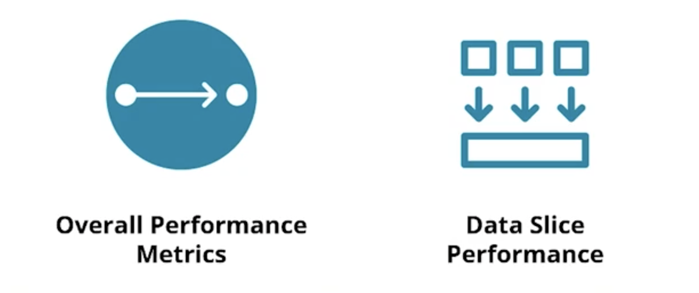

## Recap Lesson 1: Introduction to Deploying a Scalable ML Pipeline in Production

In this lesson, we covered:
* The big picture – what is this course about and why does it matter?
* The project you'll build at the end of the course.
* The prerequisites you'll need to have before you take this course.
* The business stakeholders you'll interact with as a professional in this field.
* The tools and environment you'll need and learn in this course. 
  * Python 
  * DVC for Data and Model versioning
  * Github actions / Heroku for CI-CD
  * FastAPI for API
  * Aequitas Package for checking Model bias

-----

## Recap Lesson 2: Performance Testing and Preparing a Model for Production

**Data Slicing**: It is when we compute the metrics of our model holding certain fixed features.

Typical model validation such as validation sets and **K-Fold Cross-Validation** can be thought of as looking at **horizontal slices of the data**, i.e. an overall view of the data and performance. **Data slicing** can be thought of as looking at **vertical slices of the data**. 

