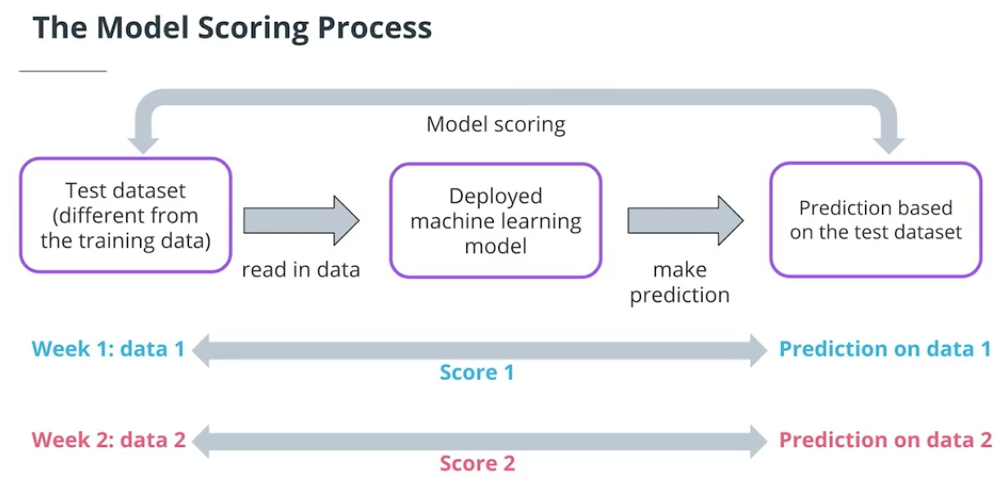

## Recap Lesson 1: Welcome to ML Model Scoring and Monitoring

In this lesson, we introduced ML Model Scoring and Monitoring. Specifically, you learned:

**Prerequisites**: you should be familiar with Python and machine learning before beginning the course.
**History of ML Scoring and Monitoring**: machine learning has existed for centuries, but the last few decades have had the most exciting new developments.
**When to use ML Model Scoring and Monitoring**: you should use the skills in this course every time you have a deployed ML model that will be used regularly. You may not need to use these skills if your model is only needed for one use, or if you're only doing exploration.
**Stakeholders**: company leaders, data scientists, ML engineers, and data engineers all have a need to be involved with ML Model Scoring and Monitoring processes.
What you'll build: your final project will be a dynamic risk assessment system that you'll build from the ground up.

----


## Recap Lesson 2: Model Training and Deployment

This lesson was concerned with data ingestion and model training and deployment. In this lesson, we learned how to:

* automatically ingest data, for use in the model, and for model training
* keep records related to ML processes, including data ingestion
* automate ML processes using cron jobs
* retrain and re-deploy ML models

These skills are important for every ML project. It's crucial to be able to ingest new data that your model needs. It's just as crucial to retrain and re-deploy your model regularly to keep it up-to-date. Being able to keep records about processes and automate them will also be important throughout the rest of the course.


## Recap Lesson 3: Model Scoring and Model Drift

### Learning: 

#### Model Drift
Model drift is a term that refers to the degradation or decrease in a model's performance over time.

There are a few things that can cause model performance to decrease over time:

**Changes in the target variable**: in the example illustrated above, you can see a hypothetical ML model predicting house prices. When prices change, as they do almost constantly, a previously trained model will become less accurate, and obsolete.
**Changes in the predictor variable**: if the model was trained to predict prices of houses with 2 or 3 bedrooms, but builders start to build houses with 4 or 5 bedrooms, it's possible that the model will perform worse because the predictor variable is outside the range where the model was trained.
**Changes in the relationship between predictor and target**: many factors, such as utility prices, changing tastes, and new technology, can cause the relationship between predictors and targets to change, which can make models perform worse.

**Model scoring**:



#### Checking for Model Drift
There are 3 main and simple ways to out of multiple to check for model drift:

* **Raw Comparison Test**: In this test we compare the model sscore with all the previous score. This is high sensitive test and not recommanded due to sensitivity.

<details>
<summary> Example: Raw Comparison Test </summary>
<hr>

```
new_f1_score = <new F1 Socre>
previous_scores_list = <List of all previous models F1 Scores> 

model_drift = new_f1_score < np.min(previous_scores_list)

```

</hr>
</details>
<br>
<br>


* **Parametric significance test**: This test checks the standard deviation of all the previous scores. **Then it will conclude the new model has worse performance than the previous models if the new model score is more than 2 std away from mean of all previous scores.**


One issue with parameteric significance test is, it depends on the bell curve and sensitive to outliers i.e. it expects the data to be linear. But in real world, its not the case, we generally see more non-linear data. Therefore **Non-parametric-test** is more appropriate.

<details>
<summary> Example: Parametric significance test </summary>
<hr>

```
new_f1_score = <new F1 Socre>
previous_scores_list = <List of all previous models F1 Scores> 

model_drift = new_f1_score < np.mean(previous_scores_list) - 2 * np.std(previous_scores_list)

```

</hr>
</details>
<br>
<br>


* **Non-Parametric-Outlier-Test**: Instead of std this test uses IQR (interquartile range). This test doens't have any requirements for data distribution since it works on interquartile range (difference bwtween q3, q1 (q3-q1) OR (q75 - q25)).

In this test we consider model drift occurs when and only if it's either :
    -> more or above high outlier ( `q3 + 1.5 * IQR`)
    -> less or below lower outlier ( `q1 - 1.5 * IQR`)


---


---


<details>
<summary> Example: Non-Parametric-Outlier-Test </summary>
<hr>

```
new_f1_score = <new F1 Socre>
previous_scores_list = <List of all previous models F1 Scores> 

iqr = np.quantile(previous_scores_list, 0.75) - np.quantile(previous_scores_list, 0.25)
model_drift = new_f1_score < np.quantile(previous_scores_list, 0.25) - (1.5 * iqr)
```

</hr>
</details>
<br>
<br>


**Hypothesis Testing**: This is a methods for comparing two different models. In hypothesis testing:
* load previous scores for both models
* Use a t-test to compare the two sets of scores.
* Check weather p < 0.05
* If p < 0.05, that means the difference between the models is "Statistically Significant"


In this lesson, we learned how to score models and check for model drift. We covered all of the following topics:

Automatic model scoring: how to read data and score models automatically
Recording model scores: how to keep persistent records of model scores in your workspace
Model drift: how to perform several different tests to check for model drift
Hypothesis testing: how to use statistical tests to compare two different models
These skills are very important for all ML projects. By scoring models, you can ensure that they're up-to-date, and as accurate as possible.


----

## Recap Lesson 4: Diagnosing and Fixing Operational Problems

**Data Integrity**: When data is missing or invalid, we say this **data integrity** issue. We can check the data integrity issue by counting the NaN values.<br>
**Data Stability**: When data contains values that are different from what we expect, we say there's a **data stability** issue. We can check for data stability issue by calculating and compare the mean and median of previous versions of the data. <br>


**Summary**

This lesson was about diagnosing and resolving operational issues. In this lesson, you learned how to:

* Time ML processes, and determine whether there are speed or latency issues
* Check for integrity and stability issues in data
* Check for dependencies, and resolve dependency issues
* Perform data imputation: a method for resolving data integrity problems


