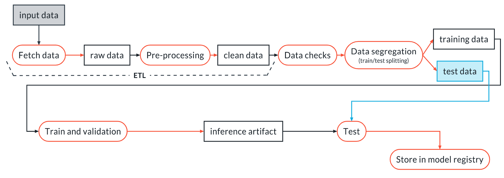

# Udacity Machine Learning DevOps Engineer Nanodegree
This is Udacity Machine Learning DevOps Engineer Nanodegree personal repo. This contains the projects built in this nanodegree to build DevOps skills required to automate the various aspects and stages of machine learning model building and monitoring.

[Project 1: Predict Customer Churn with Clean Code](https://github.com/msinha251/Udacity_Machine_Learning_DevOps_Engineer_Nanodegree/tree/main/1_Clean_code_principals)
In this project, you will implement your learnings to identify credit card customers that are most likely to churn. The completed project will include a Python package for a machine learning project that follows coding (PEP8) and engineering best practices for implementing software (modular, documented, and tested). The package will also have the flexibility of being run interactively or from the command-line interface (CLI).

This project will give you practice using your skills for testing, logging, and best coding practices from this lesson. It will also introduce you to a problem data scientists across companies face all the time. How do we identify (and later intervene with) customers who are likely to churn? 

[Project 2: Build an ML Pipeline for Short-term Rental Prices in NYC](https://github.com/msinha251/build-ml-pipeline-for-short-term-rental-prices)
Consider you are working for a property management company renting rooms and properties for short periods of time on various platforms. You need to estimate the typical price for a given property based on the price of similar properties. Your company receives new data in bulk every week. The model needs to be retrained with the same cadence, necessitating an end-to-end pipeline that can be reused.

In this project you will build such a pipeline, similar to below.

[Project 3: Deploying a Machine Learning Model on Heroku with FastAPI](https://github.com/msinha251/Udacity_MLDevops_C3_Project)
In this project,  we applied the skills that we have acquired in this course to develop a classification model on publicly available Census Bureau data. We created unit tests to monitor the model performance on various slices of the data. Then, we deployed our model using the FastAPI package and create API tests. Both the slice-validation and the API tests will be incorporated into a CI/CD framework using GitHub Actions as well as used DVC for our data / model versioning.

